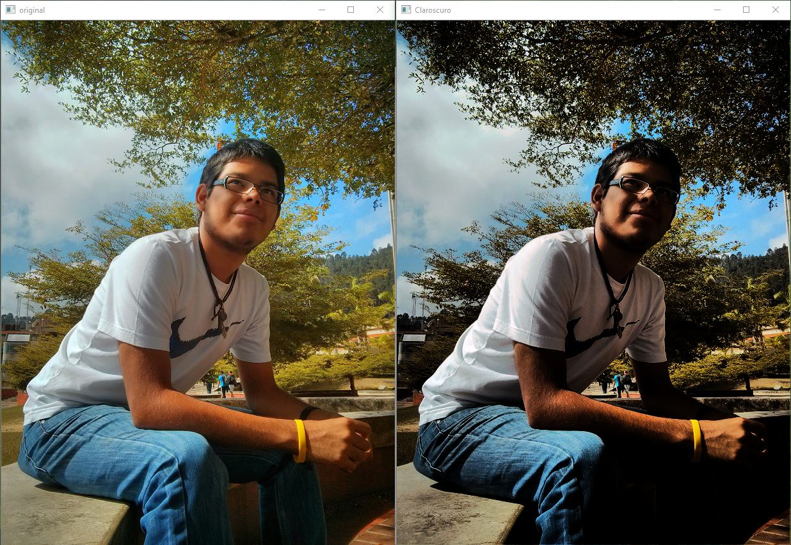
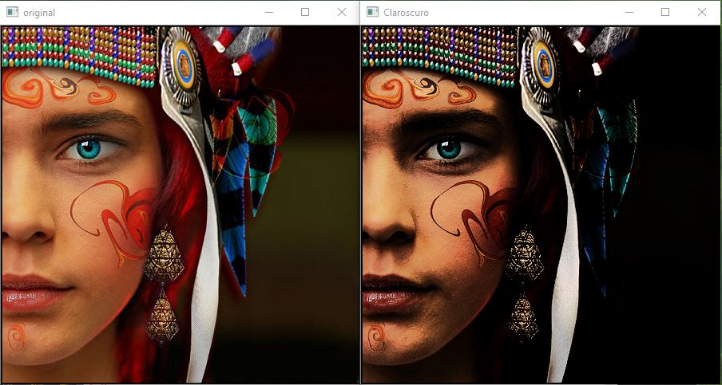
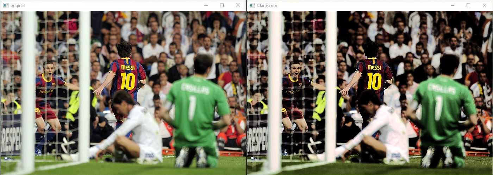

# ClarOscuro
Takes an image and chages it's color pallete to resemble a Chiaroscuro type of paint.

## Table of contents
* [General info](#general-info)
* [Screenshots](#screenshots)
* [Setup](#setup)
* [Status](#status)
* [Contact](#contact)

## General info
This program was made as part of a course project, the goal was to meka a code capable of taking any photo and make a simple tranformations necesary to resempble a particular type of art, in this case the style chosen was "Chiaroscuro". It was developed on Python and all the image prossesing it's done using Numphy.
The code reads every pixel, it calculates it's color intensity and applies some transfomation depending on the color distribuition. The result it's a pronintieantion of the bright secctions but overall darkness of the image while making little emphasys on the red colors.

## Screenshots

## Setup
The only necessary libraries are **Numphy** for the image proccessing and **OpenCV**, wich is used to show the image (original and final).
To run the code you need to place the image to be transformed on the same folder as the code and either set it's name to *"1.jpg"* or change the image path/name inside the code on the variable **path**

## Status
Project is:_finished_

## Contact
Created by [@KennyJaimes](https://www.linkedin.com/in/kennyjaimes/?locale=en_US) - feel free to contact me!